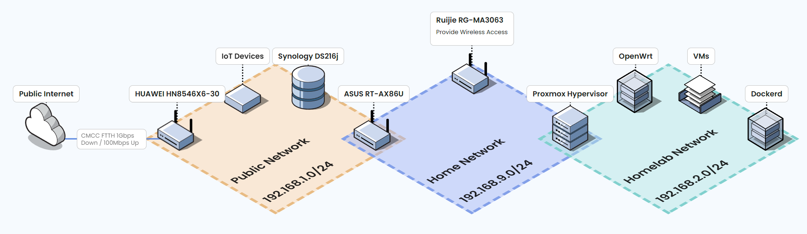

# Homelab Documents

## Network Topology

- 通过一台中国移动发放的 `HUAWEI HN8546X6-30` 光猫实现对外的 1Gbps 下行 / 100Mbps 上行 FTTH 网络连接
- 无奈家里缺少 VLAN 管理设备，大部分 IoT 设备放在由光猫所处的 192.168.1.0/24 网段进行隔离
- 主要的数据存储由一台 `Synology DS216j` 加 2 块 HDD 服务，运行 HomeBridge 服务连通米家、HomeKit、Aqara 生态
- 通过一台 `ASUS RT-AX86U` 路由器在 192.168.9.0/24 网段提供家庭内网访问，网络上连接了 Apple TV、PS5、MBP 等诸多设备
- 附加一台运行在桥接模式的 `Ruijie RG-MA3063` 路由器扩大 Wi-Fi 覆盖，开启了设备的 OpenWrt 后台并关闭 DNS 劫持
- 在老旧的台式机上部署 Proxmox Hypervisor，虚拟化运行多种服务，其中包含一个 OpenWrt 和 Docker
- OpenWrt 作为虚拟网络的路由器，将虚拟机划分在 192.168.2.0/24 网段，大部分 Docker 容器使用 MacVlan 运行在同网段

> Diagram drawn by [isoflow.io](https://isoflow.io/app)
